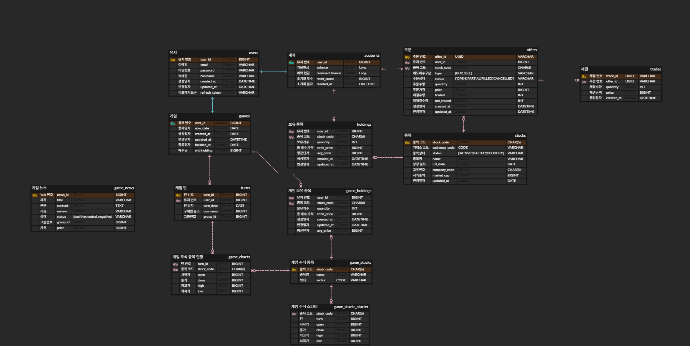
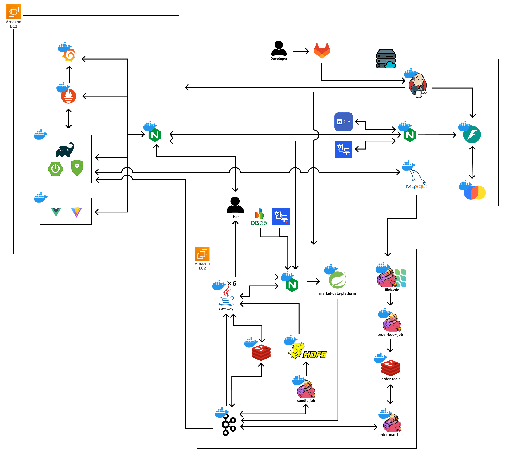
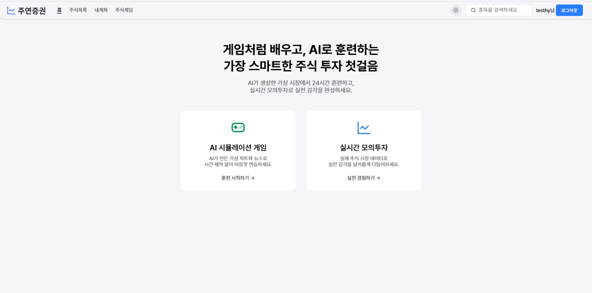
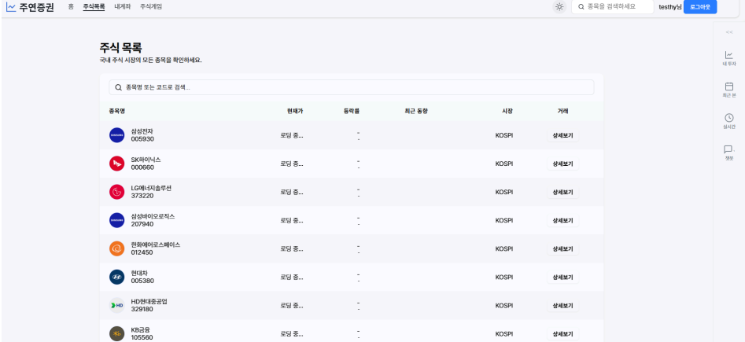
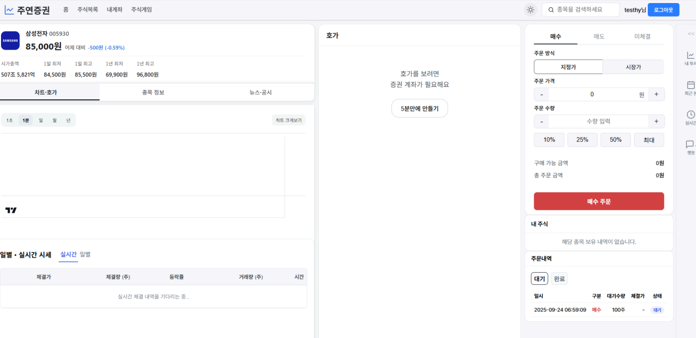
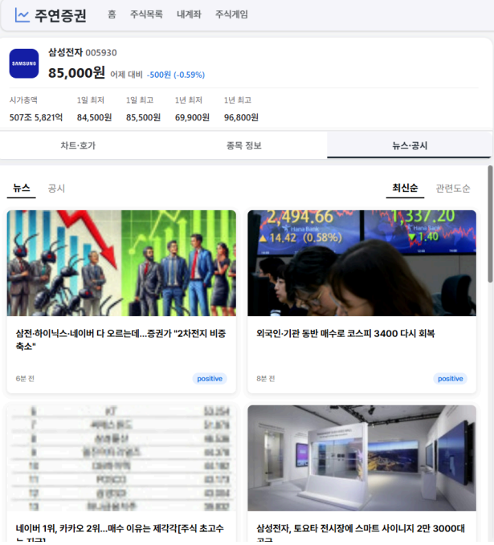

# 📈 Jooyeon (주연) - 실시간 주식 모의투자 플랫폼
> 초단위로 변동하는 주가 데이터를 실시간으로 가공, 송출, 거래·정산까지 처리하는 **End-to-End 금융 트레이딩 파이프라인** <br>
> 실시간 금융 데이터를 기반으로 한 모의투자 + 뉴스 기반 예측형 턴제 주식 게임 + AI 챗봇 

## 🔗 Jooyeon 링크
https://i13d205.p.ssafy.io/

---
## ⏰ 프로젝트 진행 기간
**2025.08.25 ~ 2025.09.29** (5주)  
SSAFY 13기 2학기 특화프로젝트 - Jooyeon

---


## 📖 프로젝트 소개
Jooyeon은 **실시간 주식 데이터 기반 모의투자**와 **뉴스 분석을 통한 턴제 예측형 주식 게임**, 그리고 **AI 챗봇 보조 시스템**을 결합한 통합 금융 시뮬레이션 플랫폼입니다.

실시간 모의투자 모드에서는 Kafka와 Flink를 통해  
**실제 주식 시장 데이터를 틱 단위로 스트리밍**합니다.
사용자는 실제 시장과 동일한 환경에서 **주문·체결·정산 전 과정을 체험**할 수 있습니다.

각 주식 종목의 **실시간 뉴스**, **공시 정보**, **손익계산서 및 대차대조표 등 재무제표 데이터**를 함께 제공하여  
사용자가 다양한 관점에서 투자 결정을 내릴 수 있습니다.

턴제 주식 게임 모드에서는 매 턴마다 제공되는 **뉴스 데이터를 분석해  
다음 턴의 주가를 예측하고 투자 전략을 세우는 시뮬레이션**을 제공합니다.  
이 과정에서 AI가 생성한 가상 시세와 뉴스 이벤트를 기반으로  
사용자는 **투자 판단력과 시장 이해도**를 동시에 향상시킬 수 있습니다.

또한, Jooyeon의 AI 챗봇은 **MCP(Model Context Protocol)** 을 통해  
“PER이 뭐야?”, “삼성전자 시장가로 10주 매수해줘”, "삼성전자 10만원에 매도 예약해줘" 등 자연어 명령을 인식하여  
**주식 용어 설명부터 실시간 매수·매도 명령 처리까지** 지원합니다.  
이를 통해 초보 투자자도 자연스럽게 학습하며 시장과 상호작용할 수 있습니다.

---

## 🚀 주요 기능
- **실시간 모의투자** – Kafka·Flink 기반 파이프라인으로 실제 주식 데이터를 초 단위 스트리밍, 사용자는 실시간으로 매수·매도·정산을 수행하며 실제 거래 환경을 체험

- **턴제 주식 게임 모드** – 매 턴마다 제공되는 뉴스 데이터를 분석해 다음 턴의 주가를 예측하고 투자 전략을 세우는 예측형 시뮬레이션. 턴 종료 시 수익률 자동 반영

- **AI 주식 챗봇 (MCP 기반)** – 자연어 명령을 인식하여 주식 용어 설명부터 매수·매도 명령, 주가 예측 등 대화형 투자 도우미

- **뉴스 및 공시 데이터 제공** – 종목별로 **실시간 뉴스**, **공시 정보**, **손익계산서**, **대차대조표**를 제공하여 종합적인 투자 판단 지원

- **실시간 시세 스트리밍 & 알림 (SSE)** – Redis 캐시와 SSE를 통해  
  체결·정산 결과, 시세 변동, 뉴스 업데이트를 0.5초 단위로 실시간 전달

---

## 🛠 기술 스택

### **Backend**


### **Streaming & Messaging**


### **Database & Cache**


### **Frontend**


### **AI & Chatbot**


### **실시간 통신**


### **Infrastructure & DevOps**


### **Communication**


## 📂 폴더 구조
```
S13P21D205/
├── jooyeon-web/     # Backend, Frontend
├── jooyeon-ai/      # ai 서버
├── jooyeon-live/    # 실시간 데이터 파이프라인 및 스트리밍 모듈
└── README.md        # 프로젝트 개요 및 실행 가이드 문서
```

### Backend
```
jooyeon_backend
├── application
│   ├── account
│   │   ├── controller
│   │   ├── dto
│   │   ├── entity
│   │   ├── repository
│   │   └── service
│   ├── auth
│   │   ├── controller
│   │   ├── dto
│   │   │   ├── login
│   │   │   └── token
│   │   ├── repository
│   │   └── service
|   ├── chat
│   │   ├── controller
│   │   └── dto
│   ├── dart
│   │   ├── controller
│   │   └── service
│   ├── game
│   │   ├── controller
│   │   ├── dto
|   |   |   ├── fastapi
|   |   |   ├── request
|   |   |   └── response
│   │   ├── entity
│   │   ├── repository
│   │   └── service
│   ├── kis
│   │   ├── controller
│   │   └── service
│   ├── notify
│   │   ├── controller
│   │   ├── dto
│   │   └── sse
│   ├── stock
│   │   ├── controller
│   │   ├── dto
|   |   |   ├── request
|   |   |   └── response
│   │   ├── entity
│   │   ├── repository
│   │   └── service
│   ├── trading
│   │   ├── consumer
│   │   ├── controller
│   │   ├── dto
|   |   |   ├── event
|   |   |   ├── request
|   |   |   └── response
│   │   ├── entity
│   │   ├── repository
│   │   └── service
│   └── user
│       ├── controller
│       ├── dto
│       ├── entity
│       ├── repository
│       └── service
├── common
│   ├── external.fastapi
│   ├── jwt
│   └── ratelimit
└── config
    └── security
```

### Frontend
```
jooyeon_front/
├── app/
├── public/
└── src/
  ├── api/
  │ ├── account/
  │ ├── auth/
  │ ├── game/
  │ ├── stock/
  │ └── trading/
  │
  ├── asset/
  │
  ├── components/
  │ ├── account/
  │ ├── common/
  │ ├── game/
  │ └── stock/
  │
  ├── lib/
  │ ├── ndjson/
  │ ├── sse/
  │ └── ws/
  │
  ├── router/
  │
  ├── stores/
  │ ├── stock/
  │ └── (account, auth, game, chatbot 등)
  │
  └── views/ # 페이지 단위 컴포넌트
```

### Live_Stock
```
jootyeon_live/
├── flink-candle-job/ # 실시간 캔들 데이터 집계 Flink Job
│ └── src/
│    └── main/
│       ├── java/com/example/candles/
│       └── proto/market/
│
├── flink-cdc/ # Flink CDC (MySQL 변경 데이터 수집)
│
├── hdfs/ # HDFS 설정 및 데이터 노드 실행 스크립트
│
├── kafka/ # Kafka 초기화 및 토픽 생성 스크립트
│ └── init/
│
├── market-data-platform/ # 실시간 시세 및 차트 데이터 제공 서버 (Spring Boot)
│ └── src/
│    └── main/
│       ├── java/com/jooyeon/market/
│       │ ├── candle/ # 캔들(OHLC) 데이터 처리
│       │ ├── chart/ # 차트 데이터 수집 및 가공
│       │ ├── config/ # Spring 설정 및 환경 변수 관리
│       │ └── ingester/ # 외부 데이터 소스 연동 및 Kafka 송신
│       ├── proto/market/
│       └── resources/
│
├── nginx/ # Nginx 설정 (로컬/프로덕션/SSL 환경)
│ └── conf.d/
│
├── order-book-job/ # 주문장(OrderBook) 데이터 처리 Flink Job
│ └── src/
│    └── main/
│       └── java/com/orderbook/
│          ├── functions/
│          ├── redis/
│          └── sink/
│
├── order-matcher/ # 주문 체결(매칭) Flink Job
│ └── src/
│    └── main/
│       ├── java/com/ordermatcher/
│       │ ├── functions/
│       │ ├── model/
│       │ ├── redis/
│       │ └── sink/
│       └── proto/
│
└── push-gw/ # 실시간 데이터 푸시 게이트웨이
   └── src/
      └── main/
         ├── java/com/example/pushgw/
         └── proto/market/
```

### AI
```
jooyeon_ai/
└── AI-server/
   └── app/ # AI 서버 (Python 3.11, FastAPI)
      ├── core/ 
      ├── data/ 
      ├── models/
      │ ├── chatbot/
      │ ├── news/
      │ └── prediction/
      ├── routers/ # FastAPI 라우터 (chatbot, news, prediction, health 등)
      └── services/
         ├── chatbot/
         ├── kis/
         ├── news/
         ├── prediction/
         └── sentiment/
```

## 👥 팀원 소개

|  |  |  |   |   |  |
|:----------:|:----------:|:----------:|:----------:|:----------:|:----------:|
| **박상준**<br/>(Infra) | **이창환**<br/>(Backend) | **박원준**<br/>(Backend) | **김채일**<br/>(Infra) | **이경재**<br/>(Frontend) | **송하윤**<br/>(AI) |
| **Infra**<br/>AWS EC2<br/>Docker<br/>Nginx<br/>SSL<br/> | **Backend**<br/>Spring Boot<br/>Apache Kafka<br/>Apache Flink<br/>Apache Hadoop<br/>실시간 데이터 파이프라인 설계 | **Backend**<br/>Spring Boot<br/>Spring Data JPA<br/>MySQL<br/>SSE<br/>턴제 게임<br/>Spring Security<br/>JWT<br/>CRUD<br/>DB설계<br/> | **Infra**<br/>AWS EC2<br/>Docker<br/>Nginx<br/>SSL<br/>Prometheus<br/>Grafana<br/>Jenkins<br/>DART API 연결<br/> | **Frontend**<br/>React 18<br/>TailwindCSS<br/>WebRTC<br/>OpenVidu<br/>사용자 UI/UX<br/>컴포넌트 설계 | **AI**<br/>Docker<br/>Python<br/>Langchain<br/>AI 모델 설계<br/>주식 뉴스 |


---
## 📊 ERD Diagram



---
## 📋 Porting Manual

[Porting Manual](./exec/Porting_Manual.pdf)

---

## 🏗 시스템 아키텍처


## 🧩 구성 요소

- **클라이언트 (사용자 / 투자자)**  
  Vue 3 + Pinia 기반 SPA.  
  - 실시간 시세 차트, 종목 검색, 공시·재무제표·뉴스 조회, 유저 포트폴리오  
  - 챗봇 대화창을 통한 투자 지식 학습 및 자연어 매매 명령 수행  

- **모의투자 / 턴제 게임 백엔드**  
  Spring Boot 서비스로 주문·체결·정산 로직 및 턴제 게임 상태 관리  
  - Kafka Topic(`order-created`, `order-executed`) 기반 비동기 이벤트 처리  
  - Flink CDC로 MySQL 변경 스트림 반영  

- **AI 서버 (jooyeon_ai)**  
  Python 3.11 + FastAPI 기반  
  - MCP(Model Context Protocol)로 챗봇 질의·명령 처리  
  - OpenAI + LangChain 기반 자연어 이해  
  - 주식 용어 설명, 종목 뉴스 요약, 공시 요약, 매매 명령 수행  

- **데이터 파이프라인 (jooyeon_live)**  
  Kafka–Flink–HDFS-Redis로 구성된 실시간 데이터 스트리밍 인프라  
  - **flink-cdc**: MySQL CDC 기반 실시간 변경 데이터 수집  
  - **order-book-job**: 주문장 데이터 스트림 처리  
  - **order-matcher**: 매수·매도 매칭 및 체결 이벤트 생성  
  - **market-data-platform**: 주식 체결·호가 데이터 실시간 처리 및 과거 차트 HDFS 저장/조회 API 제공
  - **candle-job**: OHLC 캔들 데이터 집계 및 HDFS 저장  
  - **push-gw**: 주식 체결·호가 데이터 실시간 WebSocket 전송 및 Redis 최신 상태 반영

- **Market Data Platform (시세 서버)**  
  Spring Boot 기반 시세·차트 데이터 제공 서버  
  - Flink와 연계하여 실시간 캔들 및 거래 데이터 가공  
  - Redis로 단기 캐시, HDFS로 장기 데이터 저장  
  - API를 통해 프론트엔드 및 챗봇 서버로 데이터 제공  

- **데이터베이스 / 캐시 계층**  
  - **MySQL**: 영속 데이터 저장 (주문, 체결, 유저, 게임 등)  
  - **Redis**: 실시간 체결, 주가, 대기 세션 캐싱  

- **모니터링 / 관측성**  
  - **Prometheus**: 메트릭 수집  
  - **Grafana**: 대시보드 시각화  
  - **Jenkins**: CI/CD 자동화 파이프라인  

- **배포 / 네트워크**  
  - **AWS EC2**: 주요 서비스 컨테이너 호스팅  
  - **Docker Compose**: 멀티 모듈 서비스 통합 배포  
  - **Nginx**: Reverse Proxy 및 SSL Termination  
---

## Jooyeon 서비스 화면

### 홈 화면



### 주식

**주식 목록**   


**주식 상세**  


**주식 뉴스**  


### 게임 화면

**메인 화면**  

