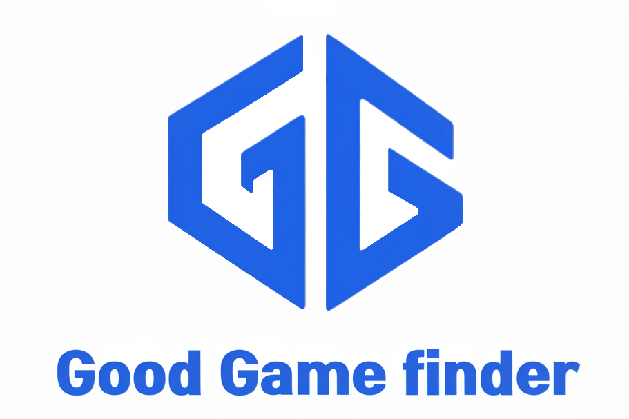
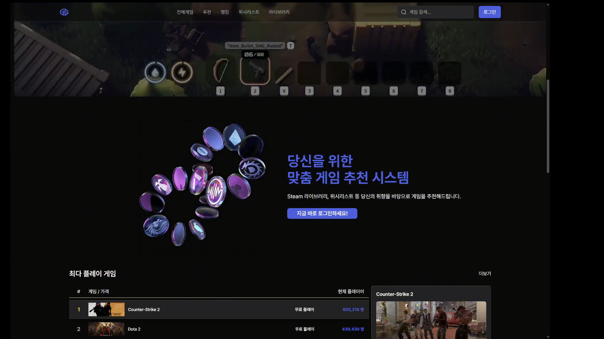
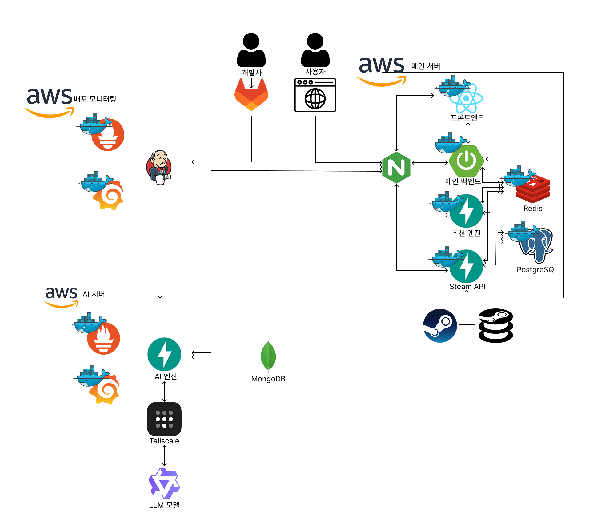

# 🎮 GG (Good Game Finder) - 게임 추천 플랫폼


**GG** 는 사용자의 취향과 상황에 맞춰 최적의 게임을 발견할 수 있도록, 각기 다른 강점을 가진 **3가지 핵심 추천 엔진**을 탑재한 AI 기반 개인화 게임 추천 플랫폼입니다.

- **개인 맞춤 추천**: 하이브리드 필터링(협업 필터링 + 콘텐츠 기반)
- **대화형 AI 추천**: RAG(Retrieval-Augmented Generation) 기반 자연어 질의응답 추천
- **아키네이터 추천**: 로직 기반 필터링을 통한 단계별 게임 탐색

---

## ✨ 주요 기능 및 설계

### 🖥️ 프론트엔드 (UI/UX)

사용자 경험의 중심이 되는 웹 애플리케이션으로, React 기반의 반응형 SPA(Single Page Application)로 구축되었습니다.

- **컴포넌트 기반 아키텍처**: 재사용성과 유지보수성을 높이기 위해 `features`와 `shared` 디렉토리 구조를 채택했습니다. 각 기능(게임, 프로필, 인증 등)별로 컴포넌트를 분리하고, 공용 컴포넌트(레이아웃, UI 요소 등)는 `shared`에서 관리하여 일관성을 유지합니다.
- **서버 상태 관리**: `TanStack Query`를 핵심 라이브러리로 사용하여 서버와의 비동기 통신을 관리합니다. 이를 통해 데이터 캐싱, 자동 리프레시, 로딩 및 에러 상태 처리를 선언적으로 구현하여 코드 복잡도를 줄이고 사용자 경험을 향상시켰습니다.
- **UI 디자인 시스템**: `Tailwind CSS`와 `shadcn/ui`를 기반으로 자체 디자인 시스템을 구축하여, 프로젝트 전반에 걸쳐 통일성 있고 세련된 UI를 제공합니다. `Recharts`를 활용한 데이터 시각화, `embla-carousel`을 이용한 캐러셀 등 동적인 UI 요소를 적극적으로 사용합니다.
- **전역 상태 및 라우팅**: `React Context`를 통해 사용자 인증 정보(`AuthContext`), 테마(`ThemeProvider`) 등 전역 상태를 관리하며, `React Router`를 사용하여 페이지 간 부드러운 전환을 제공합니다.


### ⚙️ 3가지 핵심 추천 엔진

GG 플랫폼은 사용자의 다양한 탐색 시나리오에 대응하기 위해 세 가지의 독립적인 추천 엔진을 제공합니다.

#### 1. 개인 맞춤 추천 (Hybrid Recommendation)


> "나의 플레이 패턴을 분석해서 좋아할 만한 게임을 자동으로 추천해줘."

- **담당 서비스**: `gg-recommend`
- **기술 방식**: **하이브리드 필터링 (협업 필터링 + 콘텐츠 기반)**
- **상세 로직**:
    1.  **데이터 분석**: 사용자의 Steam 라이브러리, 플레이 시간, '좋아요' 기록, 리뷰 평가 등 다양한 상호작용에 가중치를 부여하여 단일 상호작용 점수(`r_ui`)를 계산합니다.
    2.  **후보군 생성 (Candidate Generation)**:
        - **협업 필터링 (CF)**: 계산된 상호작용 점수를 기반으로 **행렬 연산 기반 Item-Item 코사인 유사도**를 사용하여 '나와 비슷한 취향의 유저들이 즐긴 게임'을 후보로 추천합니다.
        - **콘텐츠 기반 (CB)**: **TF-IDF**와 **TruncatedSVD**를 활용한 차원 축소로 벡터화된 게임의 콘텐츠(장르, 태그 등) 유사도를 기반으로 '내가 즐긴 게임과 비슷한 게임'을 후보로 추천합니다.
    3.  **순위 재조정 (Ranking)**: 생성된 후보군들을 인기도, 최신성, 리뷰 점수 등 다양한 기준으로 재정렬하여 최종 추천 목록을 제공합니다.

#### 2. 대화형 AI 추천 (Conversational AI Recommendation)


> "최근에 친구랑 할만한 긴장감 넘치는 멀티플레이 FPS 게임 뭐 없을까?"

- **담당 서비스**: `AI-SERVER`
- **기술 방식**: **생성형 AI (RAG - Retrieval-Augmented Generation)**
- **상세 로직**:
    1.  **의도 분석**: 사용자의 자연어 질문 의도(단순 추천, 비교, 조건 검색 등)를 `LangChain`을 통해 분류합니다.
    2.  **정보 검색 (Retrieval)**:
        - **하이브리드 검색**: 질문의 의도와 문맥을 모두 고려하기 위해 **키워드 기반 검색(BM25)**과 **의미 기반 벡터 검색**을 동시에 사용해 가장 관련성 높은 게임들을 DB(MongoDB Atlas)에서 찾아냅니다.
    3.  **프롬프트 생성 및 LLM 호출 (Generation)**: 검색된 게임 정보, 사용자 정보(필요시), 원본 질문을 조합하여 LLM(대규모 언어 모델)을 위한 정교한 프롬프트를 생성합니다. LLM은 이 프롬프트를 바탕으로 추천 이유를 포함한 자연스러운 답변을 만들어냅니다.

#### 3. 아키네이터 추천 (Filter-based Recommendation)


> "내가 원하는 장르, 분위기, 플레이 방식을 하나씩 선택해서 딱 맞는 게임을 찾아보고 싶어."

- **담당 서비스**: `gg-backend`
- **기술 방식**: **로직 기반 필터링 시스템**
- **상세 로직**:
    1.  **질문-답변 진행**: '스무고개'처럼 시스템이 제시하는 질문(e.g., "혼자서 하는 게임인가요?", "스토리가 중요한가요?")에 사용자가 답변합니다.
    2.  **후보군 필터링**: 각 답변에 해당하는 게임 속성(장르, 태그 등)을 기준으로 전체 게임 목록을 실시간으로 필터링하여 후보군을 점차 좁혀나갑니다.
    3.  **결과 제시**: 모든 질문이 끝나면, 최종적으로 남은 게임을 추천 결과로 제시합니다. 머신러닝 모델 없이, 정해진 로직에 따라 빠르고 명확한 결과를 제공하는 것이 특징입니다.

### 🎮 게임 조회 및 필터링

#### 사이드바 정렬


#### 정렬


#### 랭킹


- 게임 목록 조회 (검색, 필터링, 정렬)
- 게임 상세 정보 조회 (미디어, 속성, 리뷰)
- 다양한 필터 옵션 (장르, 태그, 가격, 평점, 플랫폼, 언어, 개발사 등)
- 실시간 플레이어 수 랭킹
- 선정적 콘텐츠 필터링 (사용자 설정 기반)

### 👤 사용자 기능

#### 프로필


#### 스팀 로그인


#### 위시리스트


- Steam OpenID 기반 로그인 및 인증
- Steam API를 통한 보유 게임 자동 동기화 (비동기 처리)
- 보유 게임 및 위시리스트 관리 (필터링, 정렬 지원)
- 게임 리뷰 작성, 수정, 삭제 (보유 게임 사용자만 가능)
- 리뷰 평점 시스템 (0.0~5.0) 및 도움됨 기능
- 게임 좋아요 기능 및 카운트 관리
- 게임 평점 자동 계산 (리뷰 기반)

### 📊 데이터 수집 및 관리

- Steam API를 통한 게임 플레이어 수 실시간 수집
- 주기적 데이터 수집 스케줄링
- 플레이어 수 랭킹 조회 API

---

## 🏗️ 아키텍처 및 기술 스택



## 📂 폴더 구조

```bash
gg/
├── AI-server/            # 대화형 AI 추천 서버 (FastAPI, RAG)
├── gg_web/               # 웹 서비스 모놀리포 (백엔드/프론트/추천/수집)
│   ├── gg_backend/       # Spring Boot 메인 백엔드 (API, 인증, 게임/유저/리뷰/아키네이터)
│   ├── gg_frontend/      # React + TypeScript 프론트엔드
│   ├── gg_recommend/     # 개인 맞춤 추천 서비스 (CF/CB/하이브리드)
│   └── gg_ingester/      # Steam 플레이어 수 수집기
├── Monitoring-Jenkins/   # 모니터링 및 Jenkins 관련 설정
├── exec/                 # 배포/시연/외부 서비스 가이드 및 DB 덤프
├── image/                # README/문서용 이미지 (아키텍처, ERD 등)
└── README.md
```

### Backend (`gg_web/gg_backend`)

```bash
gg_backend
├── src
│   ├── main
│   │   ├── java
│   │   │   └── com.gg
│   │   │       ├── application
│   │   │       │   ├── game            # 게임 조회/필터링, 상세 조회
│   │   │       │   ├── review          # 리뷰 및 평점
│   │   │       │   ├── user            # 유저, 보유 게임, 위시리스트
│   │   │       │   ├── akinator        # 아키네이터 로직 기반 추천
│   │   │       │   └── auth            # 인증/인가, Steam OpenID 연동
│   │   │       ├── common
│   │   │       │   ├── cache           # Caffeine/Redis 캐싱 설정 및 유틸
│   │   │       │   ├── query           # QueryDSL 동적 쿼리/필터 빌더
│   │   │       │   └── steam           # Steam API 클라이언트
│   │   │       └── global
│   │   │           ├── config          # Spring 설정 (Security, CORS 등)
│   │   │           └── exception       # 전역 예외 처리
│   │   └── resources
│   │       └── application.properties  # DB/Redis/모니터링 설정
│   └── test
│       └── java                        # 단위/통합 테스트
├── build.gradle
└── settings.gradle
```

### Frontend (`gg_web/gg_frontend`)

```bash
gg_frontend
├── public
│   ├── gg-icon.png
│   ├── header-icon.png
│   └── videos
├── src
│   ├── features
│   │   ├── game          # 게임 리스트/상세, 필터/정렬, 아키네이터 UI
│   │   ├── profile       # 프로필, 보유 게임/위시리스트, 리뷰 관리
│   │   └── auth          # 로그인/로그아웃, 인증 관련 UI
│   ├── shared
│   │   ├── api           # 백엔드/AI 서버와의 통신 모듈
│   │   ├── components    # 공용 UI 컴포넌트
│   │   ├── contexts      # 전역 상태 (Auth, Theme 등)
│   │   └── routes        # 라우팅 구성
│   └── App.tsx
├── index.tsx
├── package.json
└── vite.config.ts
```

### Recommend / AI / Ingestion

```bash
AI-server
├── app
│   ├── core
│   │   ├── rag_chain.py       # RAG 파이프라인 오케스트레이션
│   │   ├── search             # BM25/Vector/Hybrid 검색
│   │   └── prompts            # 프롬프트 템플릿
│   ├── routers
│   │   └── chat.py            # 대화형 추천/응답 스트리밍 API
│   └── services
│       └── intent_classifier.py

gg_web/gg_recommend
├── app
│   ├── services
│   │   ├── candidate_cf.py    # 협업 필터링 후보군 생성
│   │   ├── candidate_cb.py    # 콘텐츠 기반 후보군 생성
│   │   └── ranker.py          # 하이브리드 랭킹/점수 통합
│   └── offline
│       └── train_pipeline.py  # 오프라인 학습 파이프라인

gg_web/gg_ingester
├── app
│   ├── api
│   │   └── routes.py          # 수집용 API 엔드포인트
│   └── services
│       └── player_collector.py (등, 플레이어 수 수집 로직)
```

## 🛠 기술 스택

### **Backend**


### **Frontend**


### **AI & Machine Learning**


### **Database & Cache**


### **Infrastructure & DevOps**


### **External API**


### **Communication**


---

## 📊 ERD Diagram


---

## 👥 팀원 소개

| [윤문정](https://github.com/yuuuuuu32) | [이창환](https://github.com/df2854) | [송하윤](https://github.com/borangnamu) | [하승재](https://github.com/SEUNGJAE-97) | [박원준](https://github.com/dnjswns98) | [박재연](https://github.com/Park-Jaeyeon) |
|:---:|:---:|:---:|:---:|:---:|:---:|
|  |  |  |  |  |  |
| 팀장, 프론트엔드 | 백엔드 | AI | 백엔드 | 백엔드/DevOps | 프론트엔드 |
